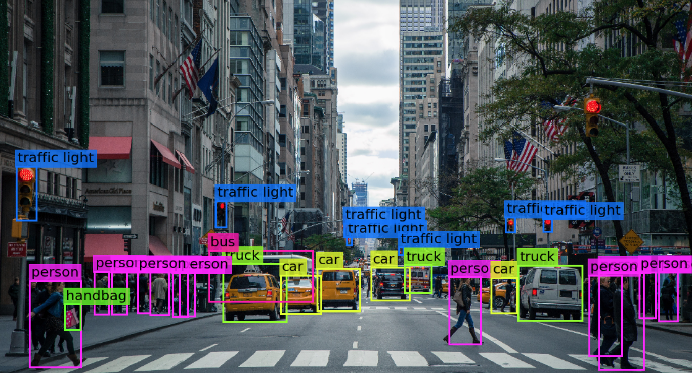
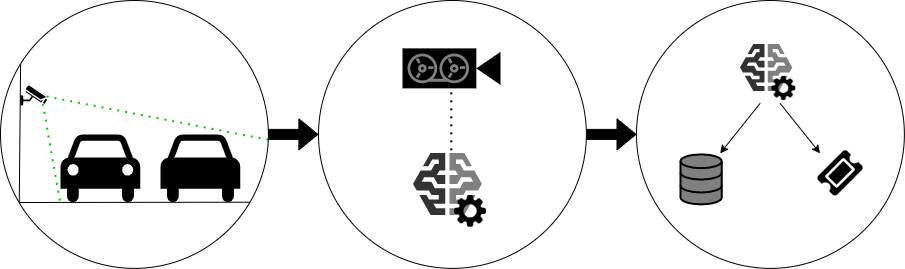
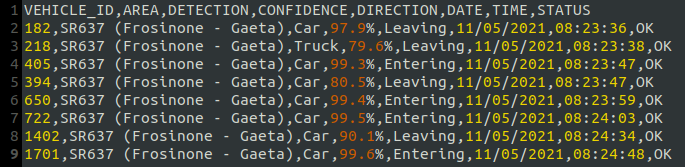
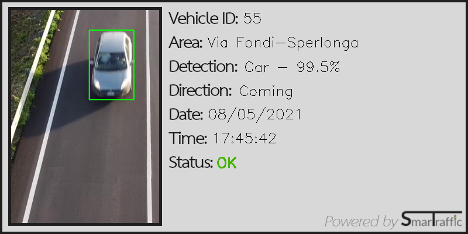

# SmarTraffic

Project for real-time telematic traffic control system.

## Summary

This project aims to exploit the potential offered by AI to adopt a real-time and fully automated road traffic control system. In order to build such a system, you will need an AI based on optical vision that can recognize vehicles, pedestrians and other objects in transit on the carriageway by alerting the authorities responsible for traffic management if necessary. 

## Background

When it comes to road safety there are a lot of factors to consider. For human being keep track of every one of them in every moment and for long period of time is impossible and that's why there are cameras along roads to do that. But the cameras are simply capable of capturing what's going on on the road and have no way of telling what they see and here's  when this project comes into play.

Video captured from the cameras are just a series of hig-speed photos (commonly known as <i>frames</i>). By applying an image-recognition algorithm to them it's possible to have a detailed "list" of what there actually is on the image (e.g. cars, bikes, people, etc.).

In addition, by associating this system with a database it is possible to collect huge amounts of data that can be analyzed to better understand traffic trends on a certain stretch of road (e.g. planning road surface maintenance at times when traffic is less intense, establishing LTFs at certain times to prevent vehicle congestion, etc.).

# How is it used?

In order to make this system possible there are some requirements: first there is a need for hardware side of a video surveillance system that resumes the road sections of interest. These shots must frame the entire carriageway so as to have a view of both directions. On the software side it is necessary to have a system that analyzes frame-by-frame images captured by the cameras and performs image recognition operations on them. Once all the useful information has been extracted, it is stored in a centralized database system so that it can be removed for future use. 

At the same time for each object located on the roadway is generated a ticket that contains all the main information.

## Data sources and AI methods

Once claired the software operating dynamics we need to work on the object-recognition part. Once acquired the various frames of the image comes into play [YOLO](https://pjreddie.com/darknet/yolo/): <i>"a state-of-the-art, real-time object detection system"</i>. 

This system is able to identify different objects present within an image (in this case frames) relying on a dataset of images specially prepared to effectively identify the main elements that can be inside the roadway (e.g. cars, motorcycles, trucks, bicycles, pedestrians, etc.). Therefore, for the proper functioning of the system the images on which to carry out the training should be taken at an angle and in a context as similar as possible to the actual conditions of use of the cameras (maybe by finding a "standard" frame for all cameras).

## Challenges

The main problem with such a system is that it is designed to work ideally in "standard" conditions of visibility, weather, etc. However, road conditions can vary considerably over time. Just think of the different light conditions between day and night or the difficulty of visibility related to rain, snow or fog. During the realization, therefore, the different contexts of use and operation of the instrument must be considered. 
Another technical problem (not strictly related to AI) of the instrument is the maintenance of the system that could become burdensome in the case of wide spread.

## What next?

The natural evolution of such a system is the creation of an automated video surveillance network on the scale. Another consequence of this idea could be the collection of traffic data on the road sections under observation. These two combined activities can be useful in the study of roads.

## Acknowledgments

- [SmarTraffic demo](https://github.com/MatteoRaffaeleDeSilvestri/SmarTraffic): a working demo to lay the foundations of operation of the proposed idea;
- [YOLO](https://pjreddie.com/darknet/yolo/): object-recognition algorithm; 
- [Draw.io](https://app.diagrams.net/): creation of the operating diagram of the application.
